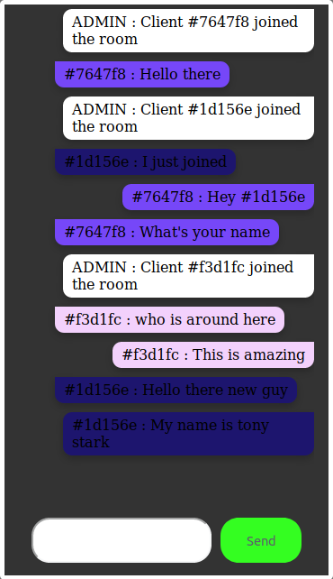

# GoSOCK

This is a basic implementation of a chatroom using websockets.
Embedded in this project is also a [custom logging library](pkg/custlog/)

[](https://travis-ci.org/deven96/gosock)


## Overview [](https://godoc.org/github.com/deven96/gosock)

## Install

```bash
    go get github.com/deven96/gosock
```

## Usage

To use the logging library, call this snippet preferably in the init

```golang

    import (
        "github.com/deven96/gosock/pkg/custlog"
    )
    
    func init() {
        // name the log file "test.log" and write to it in append mode
        def_writers := custlog.DefaultWriters("test.log", true)
        custlog.LogInit(def_writers)
    }

    func main(){
        custlog.Info.Println("This is just information")
        custlog.Warning.Println("This is just a warning")
        custlog.Error.Println("This is just an error")
    }
```

To run the project, 

```bash

    cd $GOPATH/github.com/deven96/gosock

    # run the project in develop mode
    go run *.go

    # generate executable for current os
    go build github.com/deven96/gosock

    # run the executable
    ./gosock
```

For using the binaries only, read [Binaries usage](assets/extra/usage.md)

## Example Interaction



## TODO

 - [ ] Incorporate a standard Golang ORM
 - [ ] Include User and Message models
 - [ ] Extend chat interface to include login and signup
 - [ ] Include face avatar on every message
 - [ ] Create a Rudeness API that can detect how unsensitive a statement is
 - [ ] Kick avatar out after every 3 overly rude messages
 - [ ] Deploy on Linode server
 - [ ] Linode deploy should be linked to Travis pipeline 

## License (MIT)

This project is opened under the [MIT 2.0 License](https://github.com/deven96/gosock/blob/master/LICENSE) which allows very broad use for both academic and commercial purposes.
